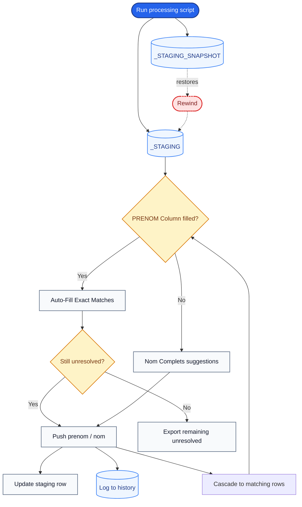
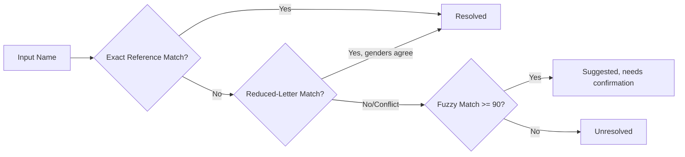

<div align="center">

<!-- Hero Banner -->


<!-- Animated Typing SVG -->
[](https://git.io/typing-svg)

<!-- Tech Stack Badges -->
[](https://www.python.org/)
[](https://flask.palletsprojects.com/)
[](https://www.microsoft.com/sql-server)
[](https://github.com/rapidfuzz/RapidFuzz)
[](#license)

<!-- Navigation -->
**Quick Start** · [Overview](#overview) · [Workflow](#main-workflow) · [Features](#features) · [Installation](#installation) · [Usage](#using-the-application) · [Safety](#data-safety--security)

</div>

---

## Overview

**Anthrofill** is a Flask + Microsoft SQL Server web application built primarily for **Moroccan name datasets**, combining **automated matching** with a **controlled human-review workflow**.

> [!IMPORTANT]
> The application **never modifies the original source table**. It always works on a staging copy where every change can be reviewed, tracked, and reverted.

It targets tables that look like this:

| Column   | Meaning              |
|----------|----------------------|
| `ID`     | Primary key          |
| `PRENOM` | First name           |
| `NOM`    | Family name          |
| `GENRE`  | Gender (often missing) |

It handles values that are missing, empty, `NULL`, `INCONNU`, or otherwise unresolved.

### Core Capabilities

| Capability | Description |
|---|---|
| **Automated exact matching** | Fills gender from the reference table on exact matches only |
| **Manual gender assignment** | Reviewer picks `MASCULIN` or `FEMININ` per record |
| **Name-based matching rules** | Honorifics, `Abd`-compounds, particles, compound first names |
| **Fuzzy matching** | RapidFuzz-powered suggestions for review (never auto-written) |
| **Full-name-only review** | Dedicated page for records where `PRENOM` is empty |
| **History tracking** | Manual and auto-fill histories, each with correction support |
| **Staging & snapshot management** | Source table untouched; all edits on a staging copy |
| **Rewind** | One-click reset of staging + history to the last script run |
| **CSV export** | Export unresolved and full-name records for external review |
| **Persistent session state** | Browser session survives refresh via `localStorage` |
| **Bilingual UI** | English and French interface |

---

## Quick Start

```bash
# 1. Clone
git clone https://github.com/OthmaneEloubbadi/AnthroFill
cd AnthroFill

# 2. Virtual environment
python -m venv venv
venv\Scripts\activate        # Windows
# source venv/bin/activate   # macOS / Linux

# 3. Dependencies
pip install -r requirements.txt
# 4. Import reference_prenom.csv into SQL Server as dbo.reference_prenom
#    (see Reference Dataset section below)

# 5. Run
python app.py
```

Open **http://127.0.0.1:5000/** or **http://localhost:5000/**

---

## Main Workflow



The **source table stays read-only** throughout the entire process.

---

## Features

### Run Script

`Run Script & Fetch Nulls` launches `db_genreFINAL.py`, which:

- Recreates the staging table from the source table
- Saves an untouched rewind snapshot of that staging table
- Creates a staging index on the primary key
- Auto-detects `PRENOM`, `NOM`, and `GENRE` columns (including aliases)
- Optionally builds the audit table when `AUDIT_CREATE = True`
- Loads unresolved records into the portal

> [!NOTE]
> The script itself does **not** write gender values to staging — it only prepares the data for review. Setting `AUDIT_CREATE = False` (the default) skips audit-table creation and the row-by-row evaluation that feeds it.

### Auto-Fill Exact Matches

- **Exact matching only** — fuzzy matching is disabled here
- Applies to rows where `GENRE` is unresolved, `PRENOM` is filled, and `NOM` is filled
- Matching covers honorifics (`Moulay`/`Sidi` → M, `Lalla`/`Hajja` → F), the `Abd + attribute` rule, compound first-name tokens, and a particle-aware exact scan over `NOM` as a fallback
- Ambiguous or unresolved rows are left untouched for manual review
- Every successful fill is logged to `_AUTO_HISTORY`

### Manual Gender Assignment

Pick `MASCULIN` or `FEMININ` for a record, then apply it with **Push prenom**.

### Push Prenom

The standard manual-resolution path:

| Step | Action |
|------|--------|
| 1 | Normalize the name |
| 2 | Validate selected gender |
| 3 | Update the reference dataset (skipped for multi-word names) |
| 4 | Update the staging record |
| 5 | Log to manual history |
| 6 | Cascade to other matching unresolved records |

### Push Nom

<details>
<summary>Special case only — click to expand</summary>

Used **only** when `PRENOM`/`NOM` are reversed in the source data (i.e. a first name landed in the `NOM` column).

**Do not** use it on real family names — doing so adds the surname to the *first-name* reference dataset and propagates its gender incorrectly. Use **Push prenom** whenever `NOM` genuinely holds family names.

</details>

### Push All

`Push All (this page)` resolves every row on the current page that already has a gender selected, handling cascade side-effects automatically. Rows with no gender chosen are skipped.

---

## Nom Complets

A dedicated page for records where:

- `PRENOM` is empty/unavailable
- `NOM` holds the **full name**
- `GENRE` is unresolved

For each one, the engine (fuzzy matching included) suggests:

- Suggested gender
- Confidence percentage
- Matching reason

> [!TIP]
> Suggestions are **never auto-written** — you must confirm and push manually.

**Export Nom complets** produces a CSV of these unresolved full-name records for external review.

---

## History

| | Manual History | Auto History |
|---|---|---|
| **Source** | Manual resolutions | Exact-match auto-fill |
| **Fields** | ID, PRENOM, NOM, corrected gender, timestamp | ID, PRENOM, NOM, assigned gender, timestamp |
| **Pagination** | Yes | Yes |
| **Session persistence** | Yes | Yes |
| **Correction control** | Yes | No |

**Correcting a historical entry** flips the gender (`MASCULIN` ↔ `FEMININ`) and **updates the existing record in place** — no duplicate history rows.

---

## Rewind

Restores the staging table to the snapshot from the most recent script run, and wipes the manual/automatic history tables.

> [!WARNING]
> `Rewind` modifies **SQL Server data**. It is not the same as *Clear Saved Data* below.

---

## Clear Saved Data

Clears only the browser's `localStorage` — saved records, current page, page size, saved DB config, interface state.

**Does NOT touch:** SQL Server data, staging table, source table, history tables, or the reference dataset.

---

## Matching Engine

Implemented once in `gender_engine.py` and shared by both the Flask app and the batch script.



| Method | Description |
|---|---|
| **Exact Reference Matching** | Normalized name looked up directly in the reference dataset |
| **Reduced-Letter Matching** | Repeated letters collapsed (e.g. `mohammed` ↔ `mohamed`) — only accepted when candidates agree on gender |
| **Fuzzy Matching** | RapidFuzz similarity scoring, default threshold **90**; used for suggestions (e.g. Nom complets), not for Auto-Fill |

**Naming rules** also cover Moroccan/Arabic conventions: naming particles, honorifics, `Abd`/`Abdel`-type prefixes, compound names, and forward/backward token analysis. When both directions agree, confidence increases; when they disagree, the result is treated as ambiguous unless a specific rule resolves it.

---

## Reference Dataset

Required file: **`reference_prenom.csv`** (provided separately).

> [!IMPORTANT]
> This CSV is a **source file only**. It is **not** read at runtime. You must manually import it into SQL Server as a table named `dbo.reference_prenom` with columns `NormalizedName` and `Gender` **before** running the app.

Both `app.py` and `db_genreFINAL.py` read directly from `dbo.reference_prenom` at runtime:

- `app.py`: `REFERENCE_TABLE = 'dbo.[reference_prenom]'`
- `db_genreFINAL.py`: `REFERENCE_TABLE = 'dbo.[reference_prenom]'`

The batch script has a CSV fallback path (`_charger_reference_csv`) only for standalone use with no live database cursor — this is not the normal workflow when running through the Flask app.

Once imported, names confirmed through the portal stay available for future processing runs.

---

## Database Tables

For a source table `dbo.high_sample`, the app creates:

```text
dbo.high_sample_STAGING
dbo.high_sample_STAGING_SNAPSHOT
dbo.high_sample_MANUAL_HISTORY
dbo.high_sample_AUTO_HISTORY
```

| Table | Purpose |
|---|---|
| **Source** | Original, read-only, never modified |
| **STAGING** | Working copy — all portal changes land here |
| **STAGING_SNAPSHOT** | Initial staging state, used by Rewind |
| **MANUAL_HISTORY** | Manual gender assignments |
| **AUTO_HISTORY** | Automatic exact-match assignments |
| **AUDIT** *(optional)* | Supported by backend; requires `AUDIT_CREATE = True` in `db_genreFINAL.py` |

> [!NOTE]
> The audit table is **disabled by default**. To enable it, set `AUDIT_CREATE = True` near the top of `db_genreFINAL.py`. When disabled, the script skips creating `_AUDIT` and skips the row-by-row evaluation that populates it. All other steps (staging, snapshot, index creation) still run.

---

## Supported Column Names

<details>
<summary>Click to see detected aliases</summary>

**First Name:** `PRENOM`, `PRÉNOM`, `first_name`, `firstname`, `first name`, `nom_prenom`

**Family Name:** `NOM`, `last_name`, `lastname`, `last name`, `family_name`, `surname`

**Gender:** `GENRE`, `GENDER`, `SEXE`

**Full Name:** `nom_complet`, `nomcomplet`, `nom complet`, `full_name`, `fullname`, `full name`, `nom_et_prenom`, `nometprenom`, `identite`, `identité`, `libelle_nom`

</details>

---

## Database Authentication

The connection form accepts:

- SQL Server host/IP
- Database name
- Target table
- SQL username / password *(optional)*

If no username/password is provided, the app falls back to **Windows trusted authentication**.

---

## Technology Stack

| Component | Technology |
|---|---|
| Backend | Python |
| Web Framework | Flask |
| Database | Microsoft SQL Server |
| Connectivity | pyodbc |
| Frontend | HTML, JavaScript |
| Matching Engine | Python |
| Fuzzy Matching | RapidFuzz |
| Translations | Custom JS i18n layer |

---

## Project Structure

```text
.
├── app.py                 # Flask backend: API, DB, history, exports, rewind
├── db_genreFINAL.py       # Batch script: staging, snapshot, indexing, processing
├── gender_engine.py       # Shared matching engine
├── index.html             # Main portal UI
├── nom_complets.html      # Full-name review UI
├── manual_history.html    # Manual history UI
├── auto_history.html      # Auto history UI
├── i18n.js                # EN/FR translation layer
├── clearSavedData.js      # Browser-state clearing
└── export_unresolved.py   # Standalone CLI exporter (optional)
```

---

## Requirements

- Python 3.x
- Microsoft SQL Server
- Compatible SQL Server ODBC driver (default: `ODBC Driver 17 for SQL Server`)
- Access + appropriate permissions on the target database
- `reference_prenom.csv` (provided separately)
- Reference data imported into `dbo.reference_prenom`

> [!NOTE]
> Permissions needed: read source, create staging/history tables, update staging records, insert reference/history records.

---

## Installation

### 1. Clone the repository

```bash
git clone https://github.com/OthmaneEloubbadi/AnthroFill
cd AnthroFill
```

### 2. Create a virtual environment

<details>
<summary>Windows</summary>

```bash
python -m venv venv
venv\Scripts\activate
```

</details>

<details>
<summary>macOS / Linux</summary>

```bash
python -m venv venv
source venv/bin/activate
```

</details>

### 3. Install dependencies

```bash
pip install Flask Flask-Cors pyodbc rapidfuzz openpyxl
```

`openpyxl` is required when spreadsheet reference resources are used.

### 4. Prepare the reference dataset

Import `reference_prenom.csv` into SQL Server as `dbo.reference_prenom` with columns `NormalizedName` and `Gender`.

```sql
-- Example import (adjust path and encoding)
BULK INSERT dbo.reference_prenom
FROM 'C:\path\to\reference_prenom.csv'
WITH (
    FIRSTROW = 2,
    FIELDTERMINATOR = ',',
    ROWTERMINATOR = '\n',
    CODEPAGE = '65001'
);
```

### 5. Prepare the source database

Ensure your source table has `ID`, `PRENOM`, `NOM`, `GENRE` (or compatible aliases).

### 6. Start the app

```bash
python app.py
```

Runs on `0.0.0.0:5000` → open **http://127.0.0.1:5000/** or **http://localhost:5000/**

---

## Using the Application

1. Open the web portal
2. Select **Access Manual Changes**
3. Click **Run Script & Fetch Nulls**
4. Enter SQL Server connection info
5. Specify target table + primary key
6. Run the processing script
7. Review unresolved records
8. Use **Auto-Fill Exact Matches** where appropriate
9. Manually assign genders to remaining records
10. Use **Push prenom** to confirm first-name resolutions
11. Use **Nom complets** for records with no first name
12. Review **Manual/Auto History** as needed
13. Export unresolved records for external review if needed
14. Use **Rewind** to restore staging to its last-script state

---

## Data Safety & Security

**Data safety:** The source table is never the working table — all edits go through `_STAGING`, and `_STAGING_SNAPSHOT` backs the Rewind feature. This is **not** a substitute for regular SQL Server backups.

**Before production use:**

- Never commit database passwords
- Never commit private/production datasets
- Restrict DB permissions to the minimum required
- Do not expose the Flask dev server directly to the internet
- Apply proper network restrictions around SQL Server
- Protect application access
- Review how credentials are stored/transmitted
- Use a production WSGI server with proper security config

---

## Important Usage Notes

> [!WARNING]
> **Use `Push prenom` for normal first-name resolution.** `Push nom` is only for reversed `PRENOM`/`NOM` data — using it on a real surname pollutes the first-name reference dataset.

- **Auto-matching is intentionally conservative** — no fuzzy matching in Auto-Fill; ambiguous results stay unresolved for manual review.
- **Nom complets ≠ auto-write** — suggestions (even fuzzy ones) always require manual confirmation.
- **Rewind ≠ Clear Saved Data** — Rewind changes SQL Server staging data; Clear Saved Data only wipes local browser state.
- **Reference table name is `dbo.reference_prenom`** — not `reference_prenom2`. Both `app.py` and `db_genreFINAL.py` reference the same table.
- **Audit is opt-in** — set `AUDIT_CREATE = True` in `db_genreFINAL.py` to generate the `_AUDIT` table.

---

<div align="center">

**Data Operations Portal**

Built for streamlined, auditable gender-data resolution in Moroccan name datasets.


</div>


